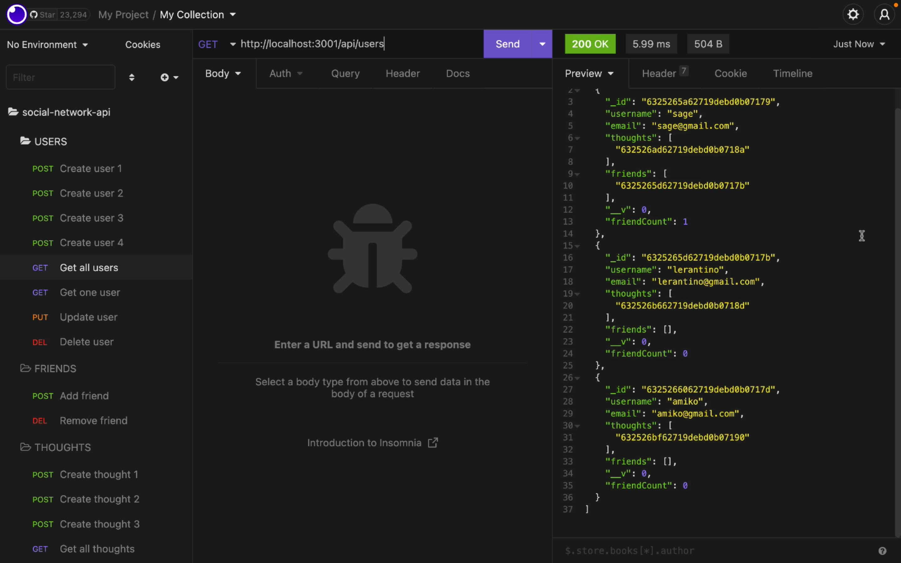

# social-network-api

## Table of Contents

* [Description](#description)
* [Access](#access)
* [Installation](#installation)
* [Usage](#usage)
* [Credits](#credits)

## Description

My goal for this project was to build an API for a social network web application where users can share their thoughts, react to friends’ thoughts and create a friend list.

### User Story

```
AS A social media startup
I WANT an API for my social network that uses a NoSQL database
SO THAT my website can handle large amounts of unstructured data
```

### Tools and Technologies Used

To create this application, I used used:
- Node.js 
- Express.js 
- MongoDB
- Mongoose
- And, Insomnia.

### Screenshot of Application



## Access

### Code Repository

The repository where the code is saved is on Github. To access it, click [here](https://github.com/hayleyarodgers/social-network-api).

### Video Walkthrough

To watch a walkthrough video that demonstrates the functionality of my social media API, click [here](./assets/walkthrough/social-media-api-demo-HRodgers.mp4) to go to the file or [here](https://drive.google.com/file/d/1ukaohNaUZ7Fchgvq31qvmOVNolPErSYx/view?usp=sharing) to view it on GoogleDrive.

## Installation

To install necessary dependencies, run the following command:

```
npm i
```

## Usage

To use the application from the command line:
1. Open the repository in your terminal or bash.
2. Start the server by entering ```npm run start```.
3. Test the API routes using Insomnia.

## Credits

- I used [Express.js](https://www.npmjs.com/package/express) for routing.
- I used [Mongoose](https://www.npmjs.com/package/mongoose) for making it easier to work with my MongoDB database.
